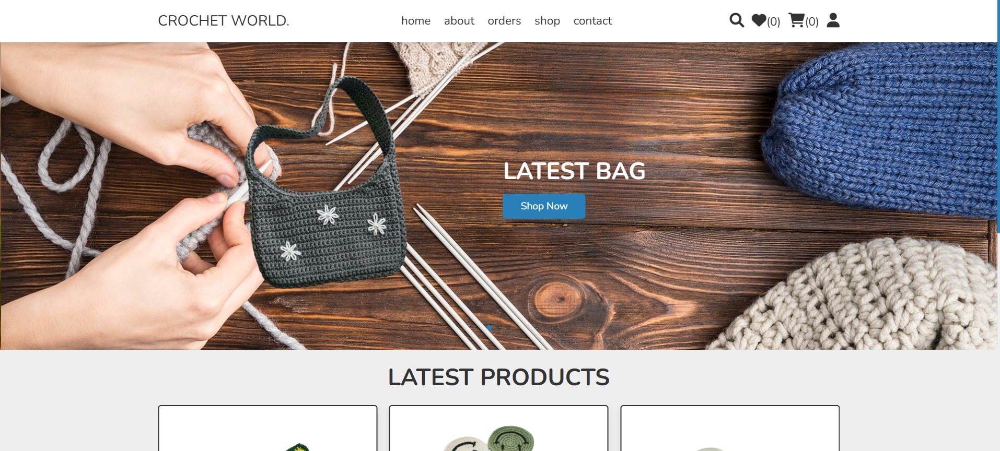
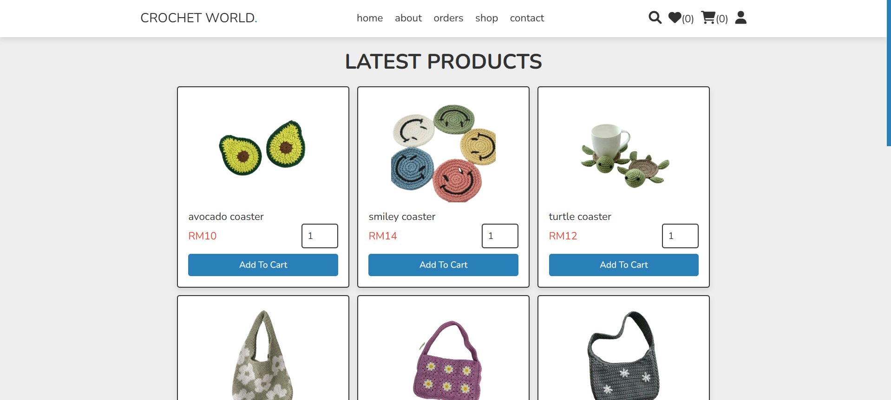
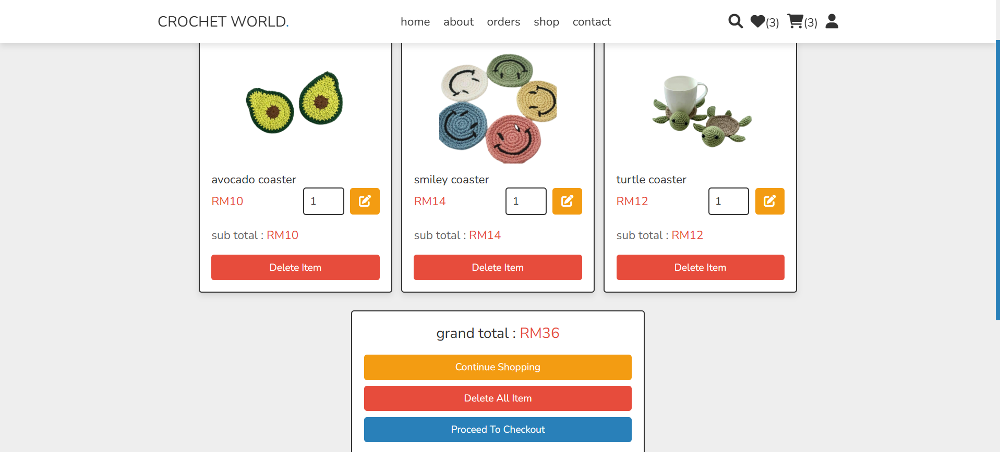
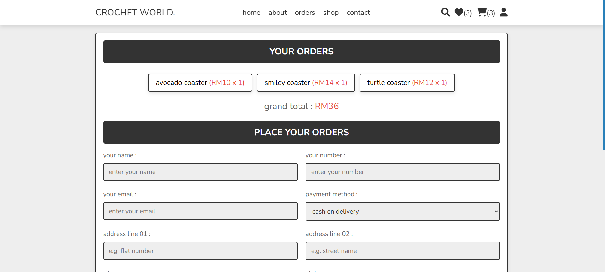
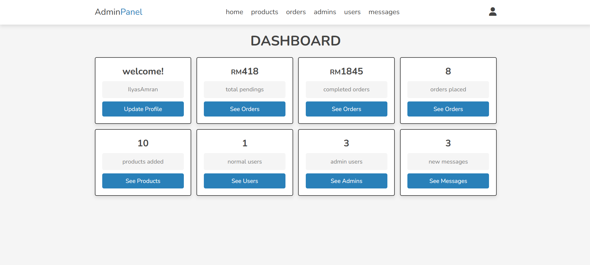
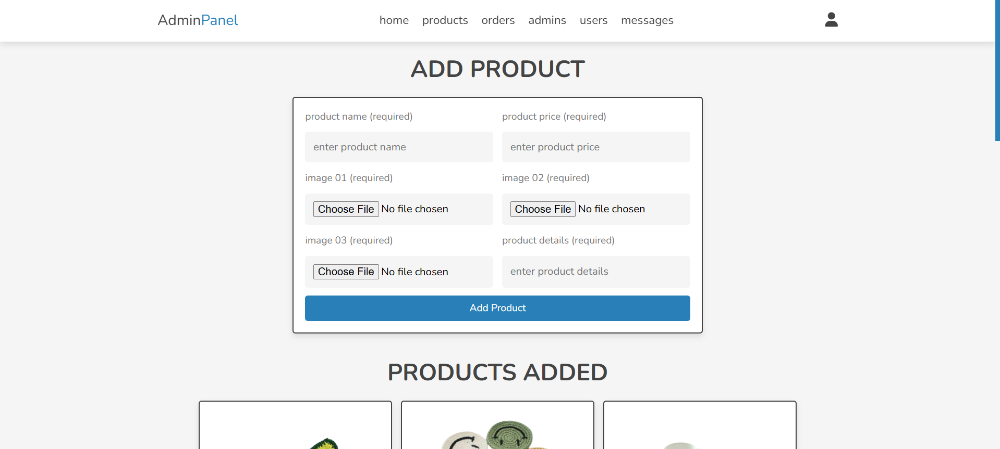
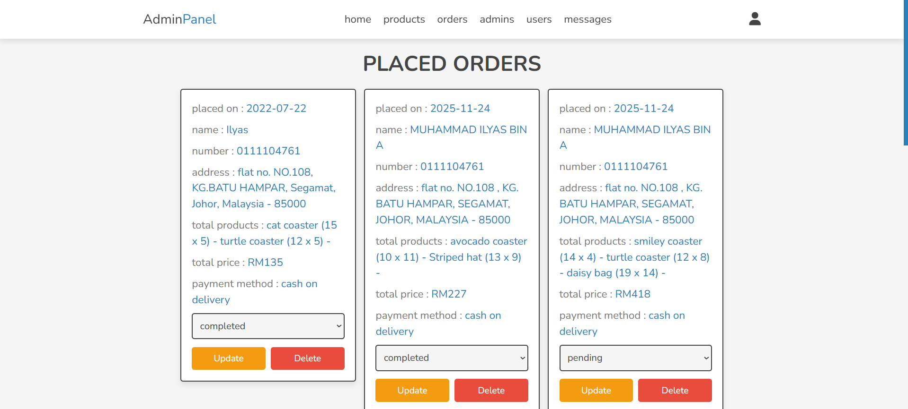
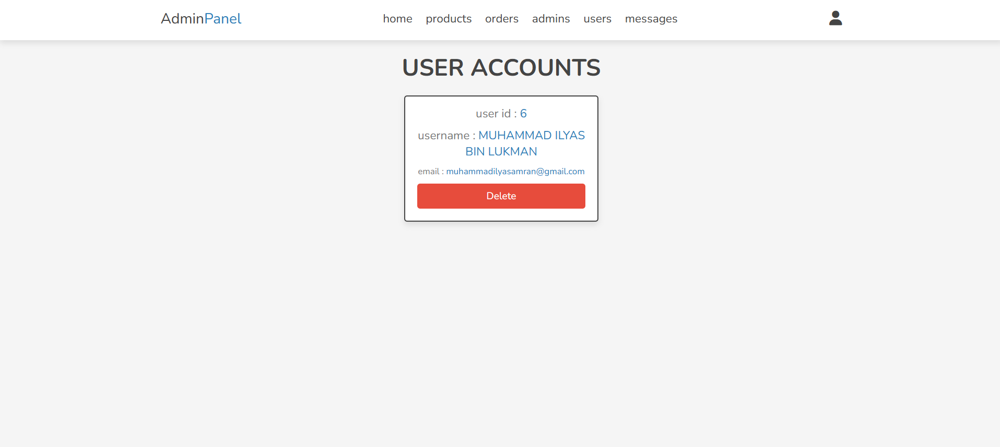

# 🧶 Crochet E-Commerce Platform

<div align="center">


**A full-featured e-commerce web application for selling handmade crochet products**

[](https://youtu.be/FtwKqkeDE5w)

[Features](#-features) • [Tech Stack](#-tech-stack) • [Screenshots](#-screenshots) • [Installation](#-installation) • [Team](#-project-team)

</div>

---

## 📖 About The Project

This is a comprehensive e-commerce platform designed specifically for selling handmade crochet products including bags, coasters, hats, and other artisanal crochet items. The platform features a complete shopping experience with user authentication, product management, shopping cart, wishlist, and order tracking capabilities.

**[🎥 Watch the Full Demo Video on YouTube](https://youtu.be/FtwKqkeDE5w)**

### 🎓 Academic Context

**Course**: CSC264 - Introduction to Web and Mobile Application  
**Institution**: Universiti Teknologi MARA (UiTM) Segamat  
**Program**: Diploma in Computer Science  
**Semester**: 4  
**Duration**: March - August 2022  
**Project Type**: Group Project (4 Members)

---

## 👥 Project Team

This project was collaboratively developed by a team of four dedicated students:

| Name | Role | Responsibilities |
|------|------|------------------|
| **Muhammad Ilyas Bin Amran** | 💻 System Analyst & Lead Programmer | Full-stack development, database design, system architecture, code implementation |
| **Nurnazatul Maisara Binti Muhammad Firdaus** | 📊 System Analyst 2 | System requirements analysis, workflow design, user stories |
| **Amirah Aisyah Binti Azman** | 📱 Mobile Web Developer | Responsive design, mobile optimization, UI/UX testing |
| **Muhamad Aidil Bin Mohd Sukor** | 📝 Documenter | Technical documentation, user manual, project reports |

---

## ✨ Features

### 🛍️ User Features
- ✅ User registration and secure authentication with password hashing
- ✅ Browse products by categories
- ✅ Advanced product search functionality
- ✅ Shopping cart management
- ✅ Wishlist for favorite products
- ✅ Secure checkout process
- ✅ Order placement and tracking
- ✅ User profile management
- ✅ Contact form and messaging system

### 👨‍💼 Admin Features
- ✅ Comprehensive admin dashboard with statistics
- ✅ Product management (Create, Read, Update, Delete)
- ✅ Order management and status updates
- ✅ User account management
- ✅ Admin account management
- ✅ Customer message inbox
- ✅ Sales analytics (pending and completed orders)

---

## 📸 Screenshots

### User Interface

<table>
  <tr>
    <td><br/><b>Homepage</b></td>
    <td><br/><b>Product Listing</b></td>
  </tr>
  <tr>
    <td><br/><b>Shopping Cart</b></td>
    <td><br/><b>Checkout Page</b></td>
  </tr>
</table>

### Admin Panel

<table>
  <tr>
    <td><br/><b>Admin Dashboard</b></td>
    <td><br/><b>Product Management</b></td>
  </tr>
  <tr>
    <td><br/><b>Order Management</b></td>
    <td><br/><b>User Management</b></td>
  </tr>
</table>

> **Note**: Create a `screenshots` folder in your repository and add your application screenshots with the filenames shown above.

---

## 🛠️ Tech Stack

### Backend
- **PHP 7.4+** - Server-side scripting and business logic
- **MySQL 8.0** - Relational database management
- **PDO (PHP Data Objects)** - Secure database abstraction layer
- **Apache 2.4** - Web server

### Frontend
- **HTML5** - Semantic markup structure
- **CSS3** - Styling with custom properties and flexbox/grid
- **JavaScript (ES6+)** - Client-side interactivity and DOM manipulation

### Development Environment
- **XAMPP** - Local development stack (Apache + MySQL + PHP)

---

## 📚 Libraries and Dependencies

### Frontend Libraries
- **Swiper.js v8** - Modern touch slider for product galleries and carousels
- **Font Awesome 6.1.1** - Icon library for UI elements
- **Google Fonts (Nunito)** - Typography with multiple font weights (200-700)

### Backend
- **PHP Extensions**: PDO, PDO_MYSQL, Session, MBString, GD, FileInfo
- **Security**: Password hashing (bcrypt), prepared statements, input sanitization

---

## 📁 Project Structure

```
Crochet-Ecommerce/
├── 📁 admin/                      # Admin panel files
│   ├── admin_accounts.php         # Manage admin accounts
│   ├── admin_login.php            # Admin authentication
│   ├── dashboard.php              # Admin dashboard
│   ├── messages.php               # Customer messages
│   ├── placed_orders.php          # Order management
│   ├── products.php               # Product management
│   ├── register_admin.php         # Register new admin
│   ├── update_product.php         # Edit products
│   ├── update_profile.php         # Admin profile settings
│   └── users_accounts.php         # User management
│
├── 📁 components/                 # Reusable components
│   ├── admin_header.php           # Admin navigation
│   ├── admin_logout.php           # Admin logout handler
│   ├── connect.php                # Database connection
│   ├── footer.php                 # User footer
│   ├── user_header.php            # User navigation
│   ├── user_logout.php            # User logout handler
│   └── wishlist_cart.php          # Cart/wishlist logic
│
├── 📁 css/                        # Stylesheets
│   ├── admin_style.css            # Admin panel styles
│   └── style.css                  # User interface styles
│
├── 📁 images/                     # Product and UI images
│
├── 📁 js/                         # JavaScript files
│   ├── admin_script.js            # Admin panel scripts
│   └── script.js                  # User interface scripts
│
├── 📄 about.php                   # About page
├── 📄 cart.php                    # Shopping cart
├── 📄 category.php                # Category view
├── 📄 checkout.php                # Checkout process
├── 📄 contact.php                 # Contact form
├── 📄 home.php                    # Homepage
├── 📄 orders.php                  # User order history
├── 📄 quick_view.php              # Product quick view
├── 📄 search_page.php             # Product search
├── 📄 shop.php                    # Product listing
├── 📄 update_user.php             # User profile update
├── 📄 user_login.php              # User login
├── 📄 user_register.php           # User registration
├── 📄 wishlist.php                # User wishlist
├── 📄 .gitignore                  # Git ignore rules
└── 📄 README.md                   # Documentation
```

---

## 🗄️ Database Structure

**Database Name**: `crochet_db`

### Tables
1. **users** - Customer account information (id, name, email, password)
2. **admins** - Administrator accounts (id, name, password)
3. **products** - Product catalog (id, name, details, price, image_01, image_02, image_03)
4. **orders** - Customer orders (id, user_id, name, number, email, method, address, total_products, total_price, placed_on, payment_status)
5. **cart** - Shopping cart items (id, user_id, pid, name, price, quantity, image)
6. **wishlist** - User wishlists (id, user_id, pid, name, price, image)
7. **messages** - Contact form submissions (id, user_id, name, email, number, message)

---

## 🚀 Installation

### Prerequisites
- XAMPP (or any LAMP/WAMP stack)
- PHP 7.4 or higher
- MySQL 8.0 or higher
- Modern web browser

### Setup Instructions

1. **📥 Clone or Download the Repository**
   ```bash
   git clone https://github.com/unatesta175/Crochet-Ecommerce-PHP-HTML-CSS-JAVASCRIPT.git
   ```

2. **📂 Move to XAMPP Directory**
   ```bash
   # Windows
   C:\xampp\htdocs\Crochet-Ecommerce
   
   # Linux/Mac
   /opt/lampp/htdocs/Crochet-Ecommerce
   ```

3. **▶️ Start XAMPP Services**
   - Start Apache
   - Start MySQL

4. **💾 Create Database**
   - Open phpMyAdmin: `http://localhost/phpmyadmin`
   - Create new database: `crochet_db`
   - Import the SQL file (if provided) or create tables manually

5. **⚙️ Configure Database Connection**
   
   Edit `components/connect.php`:
   ```php
   <?php
   $db_name = 'mysql:host=localhost;dbname=crochet_db';
   $user_name = 'root';
   $user_password = ''; // Your MySQL password
   
   $conn = new PDO($db_name, $user_name, $user_password);
   ?>
   ```

6. **🌐 Access the Application**
   - **User Interface**: `http://localhost/Crochet-Ecommerce/home.php`
   - **Admin Panel**: `http://localhost/Crochet-Ecommerce/admin/admin_login.php`

7. **👤 Create Admin Account**
   - Navigate to: `http://localhost/Crochet-Ecommerce/admin/register_admin.php`
   - Register your first admin account
   - Login with admin credentials

---

## 🔐 Security Features

- ✅ **Password Hashing**: Bcrypt algorithm with automatic salt generation
- ✅ **SQL Injection Prevention**: PDO prepared statements throughout
- ✅ **XSS Protection**: Input sanitization with htmlspecialchars()
- ✅ **Session Security**: Secure session management for authentication
- ✅ **File Upload Validation**: Image type and size validation
- ✅ **CSRF Protection**: Form-based security measures

---

## 💡 Key Features Implementation

### 🔑 User Authentication System
- Secure registration with email validation
- Password hashing using PHP's `password_hash()`
- Login with `password_verify()` for secure authentication
- Session-based user tracking

### 🛒 Shopping Cart System
- Add/remove products
- Update quantities
- Real-time price calculation
- Persistent cart (database-stored)

### 📊 Admin Dashboard
- Sales statistics (pending/completed orders)
- Product inventory management
- Order status updates
- User management

### 📦 Product Management
- Multiple image uploads (3 images per product)
- Product details with rich descriptions
- Category-based organization
- Search functionality

---

## 🤝 Contributing

We welcome contributions to improve this project! Here's how you can help:

### How to Contribute

1. **🍴 Fork the Repository**
   ```bash
   Click the "Fork" button at the top right of this page
   ```

2. **📥 Clone Your Fork**
   ```bash
   git clone https://github.com/your-username/Crochet-Ecommerce.git
   cd Crochet-Ecommerce
   ```

3. **🌿 Create a Feature Branch**
   ```bash
   git checkout -b feature/AmazingFeature
   ```

4. **✍️ Make Your Changes**
   - Write clean, readable code
   - Follow the existing code style
   - Comment your code where necessary
   - Test your changes thoroughly

5. **💾 Commit Your Changes**
   ```bash
   git add .
   git commit -m "Add some AmazingFeature"
   ```

6. **📤 Push to Your Fork**
   ```bash
   git push origin feature/AmazingFeature
   ```

7. **🔄 Open a Pull Request**
   - Go to the original repository
   - Click "New Pull Request"
   - Select your feature branch
   - Describe your changes in detail

### Code Style Guidelines

- **PHP**: Follow PSR-12 coding standards
- **JavaScript**: Use ES6+ features with consistent formatting
- **CSS**: Use meaningful class names and organize by component
- **Naming**: Use descriptive variable and function names
- **Comments**: Add comments for complex logic

### Pull Request Guidelines

- ✅ Ensure your code follows the project's coding standards
- ✅ Update documentation if you're adding new features
- ✅ Test your changes thoroughly
- ✅ Keep pull requests focused on a single feature/fix
- ✅ Write clear commit messages

### Report Issues

Found a bug? Have a suggestion? Please [open an issue](https://github.com/unatesta175/Crochet-Ecommerce-PHP-HTML-CSS-JAVASCRIPT/issues) and include:
- Clear description of the issue
- Steps to reproduce (for bugs)
- Expected vs actual behavior
- Screenshots (if applicable)

---

## 🔮 Future Improvements

- 💳 Payment gateway integration (Stripe/PayPal)
- 📧 Email notifications for orders
- ⭐ Product reviews and ratings
- 📈 Advanced analytics dashboard
- 🌍 Multi-language support
- 🌙 Dark mode theme
- 🔗 Social media integration
- 📊 Inventory management system
- 🎟️ Discount/coupon system

---

## 📄 License

This project was developed for educational purposes as part of the CSC264 course at UiTM Segamat. 

**Educational Use**: Free to use for learning purposes  
**Commercial Use**: Contact the development team

---

## 🙏 Acknowledgments

- **UiTM Segamat** - For providing the academic platform and resources
- **CSC264 Course Instructors** - For guidance and support throughout the project
- **Font Awesome** - For the comprehensive icon library
- **Swiper.js** - For the smooth slider functionality
- **Google Fonts** - For the beautiful Nunito typeface

---

## 📞 Contact

**Muhammad Ilyas Bin Amran** - Lead Developer & System Analyst

For questions, suggestions, or collaboration opportunities:

- 💼 **LinkedIn**: [Muhammad Ilyas Bin Amran](https://www.linkedin.com/in/muhammad-ilyas-bin-amran/)
- 💻 **GitHub**: [unatesta175](https://github.com/unatesta175)
- 📧 **Email**: muhammadilyasamran@gmail.com
- 📱 **WhatsApp**: +60 11-1104 7614

---

<div align="center">

**Developed with ❤️ by Team Crochet**

*UiTM Segamat • Diploma in Computer Science • 2022*

⭐ **Star this repository if you found it helpful!**

</div>
